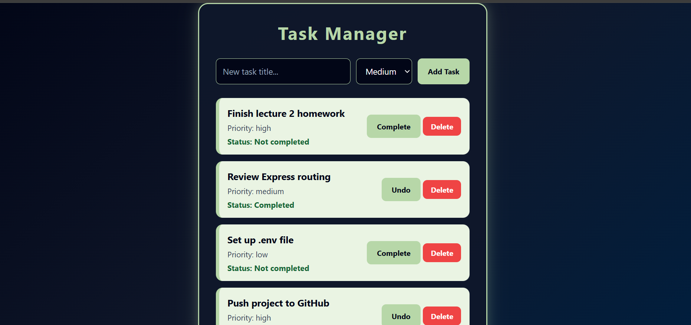

# Task Manager API

A full-stack Task Manager application built with a **Node.js Express backend** and a simple **HTML, CSS, and JavaScript frontend**. The application allows users to create, view, update, and delete tasks through a RESTful API.

## Features

- View all tasks
- Add new tasks
- Delete tasks
- Mark tasks as completed / undo completion
- Task priority management (Low, Medium, High)
- REST API architecture
- Frontend connected with backend using Fetch API
- Responsive and modern UI design

---

## Technologies Used

### Backend

- Node.js
- Express.js
- REST API
- CORS
- JavaScript

### Frontend

- HTML5
- CSS3
- JavaScript (Fetch API)

---

## Project Structure

```
Task-Manager/
│
├── backend/
|   |___config
|   | |__env.js
│   │
│   ├── controllers/
│   │   └── taskController.js
│   │
│   ├── Data/
│   │   └── taskData.js
│   │
│   ├── routes/
│   │   └── taskRoutes.js
│   │
│   ├── services/
│   │   └── taskServices.js
│   │
│   ├──.gitignore
│   │
│   └── index.js
|
|___README.md
│
├── frontend/
│   │
│   ├── index.html
│   ├── style.css
│   └── app.js
│
|___image.png
```

---

# Future Improvements

Possible improvements:

- Add user authentication
- Connect to MongoDB/PostgreSQL database
- Add task categories
- Add due dates
- Add search and filtering

---

**screenshot**


# Author

**Sifen Beyan**

GitHub:
https://github.com/sifen-Tech

---
